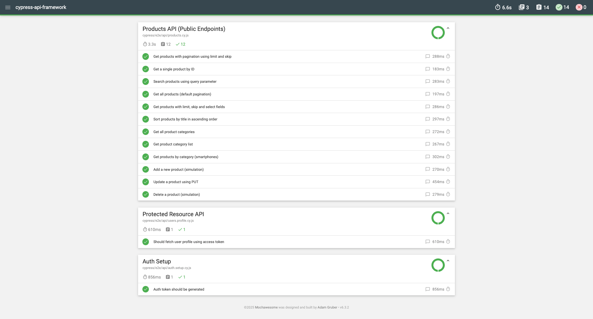

# Cypress API Automation Framework

Enterprise-grade API automation framework built using Cypress and JavaScript, designed with clean architecture, reusable components, and CI/CD-ready execution, along with rich Mochawesome HTML reporting.

## Tech Stack

* **API Testing**: Cypress
* **Language**: JavaScript (CommonJS)
* **Test Runner**: Mocha
* **Reporting**: cypress-mochawesome-reporter
* **Build Tools**: Node.js, npm
* **CI/CD**: Jenkins / GitHub Actions (ready)

## Project Structure

```
cypress-api-framework/
├── cypress/
│   ├── e2e/
│   │   └── api/
│   │       ├── auth.login.cy.js          # Authentication tests
│   │       ├── users.profile.cy.js       # Protected resource tests
│   │       └── products.cy.js            # Product APIs (public & CRUD simulation)
│   │
│   ├── support/
│   │   ├── apiClient.js                  # Reusable API client (auth & non-auth)
│   │   ├── reporter.js                   # Centralized Mochawesome reporting
│   │   └── e2e.js                        # Cypress support configuration
│   │
│   └── utils/
│       ├── authPayloadBuilder.js         # Authentication payload builder
│       ├── productPayloadBuilder.js      # Product payload builder
│       └── envManager.js                 # Environment configuration manager
│
├── reports/                              # Mochawesome HTML reports
├── cypress.config.js                     # Cypress configuration
├── package.json
├── package-lock.json
├── .gitignore
└── README.md

```

## Prerequisites

* Node.js ≥ 18
* npm ≥ 9

## Quick Start

### Clone the Repository

```bash
git clone https://github.com/<your-username>/cypress-api-automation-framework.git
cd cypress-api-automation-framework
```

### Install Dependencies

```bash
npm install
```

## Running Tests

### Run All API Tests (QA Environment by Default)

```bash
npm test
```

### Run Tests for a Specific Environment

```bash
npm run test:dev
npm run test:qa
npm run test:prod
```

### Run Only Product API Tests

```bash
npx cypress run --spec cypress/e2e/api/products.cy.js
```

### Open Cypress Test Runner

```bash
npm run cy:open
```

## Authentication Strategy

* Login API generates an access token
* Token is stored in Cypress runtime memory
* Protected APIs automatically attach Bearer token
* No dependency on test execution order
* Safe for CI pipelines and parallel execution

## Test Coverage

### Authentication

* Login and token generation
* Token reuse for protected endpoints

### Product APIs (Public)

* Get all products (pagination, limit, skip)
* Search products
* Sort products (enterprise-safe validation)
* Product categories and category-based filtering
* Add, update, and delete product (simulated behavior)

## Reporting

* Mochawesome HTML report with expandable test details
* Request and response details captured per test
* Secrets masked in reports
* No test source code displayed in reports

## Live Report Dashboards


### API Test Automation Report





## Environment Management

* Environment-specific configuration handled via `envManager.js`
* Environment selected using npm scripts or `--env` flag
* Sensitive data is excluded from version control

**Example:**

```bash
cypress run --env env=qa
```

## CI/CD Integration

This framework is designed to integrate seamlessly with:

* Jenkins
* GitHub Actions
* GitLab CI
* Azure DevOps

**Supports:**

* Headless execution
* Deterministic builds using `package-lock.json`
* Clean report generation per pipeline run

## Key Features

* Clean and scalable framework design
* Reusable API client abstraction
* Centralized reporting mechanism
* Enterprise-safe assertions
* Environment-based execution
* CI/CD-ready architecture
* Secure handling of secrets

## Contributing

1. Fork the repository
2. Create a feature branch
3. Commit your changes
4. Submit a Pull Request

## Author

**Sk Amir Ullah**  
SDET Lead | Test Automation Expert  
Founder, KnowMinds